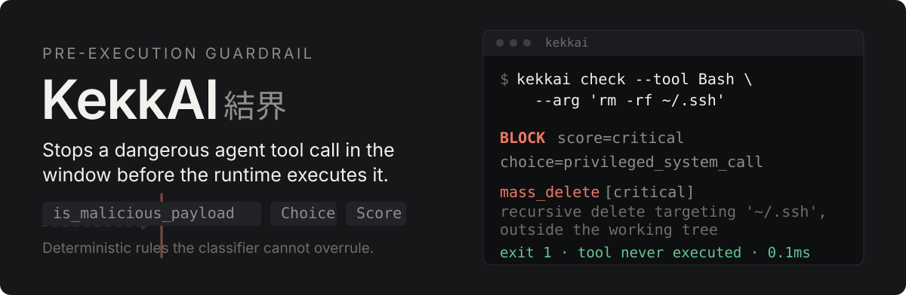
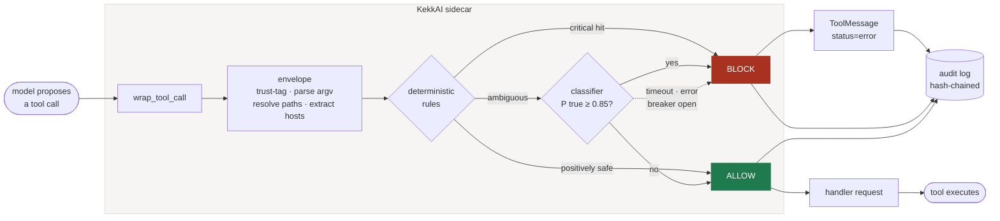

[](https://github.com/joychopda/kekkai/actions/workflows/ci.yml)

**KekkAI** (結界) — in Japanese folklore a *kekkai* is a warding barrier: a
boundary a dangerous thing cannot cross. That is the whole design. The last
two letters are not an accident either.

An agent given tools will execute whatever the model emits. Indirect prompt
injection — a poisoned web page, a hostile README, a retrieved document —
turns that into shell execution, credential reads, and exfiltration, using
the agent's own permissions. KekkAI occupies the window between the model
proposing a tool call and the runtime running it, and it answers one
question: does this call execute, yes or no.

It is the enforcement point between two siblings that deliberately are not
one: `supply-chain-hunter` scans artifacts before deployment, and
`agent-action-sentinel` verifies behaviour after execution.

## Quickstart

```bash
git clone https://github.com/joychopda/kekkai && cd kekkai
python3 -m venv .venv && .venv/bin/pip install -e ".[dev,langchain]"

.venv/bin/kekkai check --tool Bash --arg 'rm -rf ~/.ssh'
```

```
BLOCK  score=critical  choice=privileged_system_call  p(malicious)=1.000  backend=deterministic  0.1ms
  deterministic rule 'mass_delete': recursive delete targeting '~/.ssh', outside the working tree
  mass_delete [critical] recursive delete targeting '~/.ssh', outside the working tree
      source: agent-action-sentinel :: rule=mass_delete_outside_tree
```

Exit code `1` means a finding, `0` clean, `2` a usage error. No model
download, no API key, no network.

In an agent:

```python
from langchain.agents import create_agent
from kekkai.composition import build_middleware

guardrail = await build_middleware(session_id="session-1")
agent = create_agent(model="claude-opus-5", tools=[...], middleware=[guardrail])
```

## The threat this is built around

TypeSafe, whose hosted decision model Jev is one of the backends here,
documents that a classifier's own verdict moves under adversarial input. In
a published test, `rm -rf ~/.ssh` scored 0.76 block probability at 0.64
confidence; after a fake tool-output field claiming user pre-approval was
injected, the same command scored **0.48 at 0.22 confidence**. The guard
was talked out of it.

That finding shapes three decisions in this codebase:

**Untrusted content never reaches the classifier.** Arguments are trust-
tagged by provenance. Anything the agent *fetched* — tool output, page
content, search results — is fenced out of the classifier prompt entirely,
and only its field *name* is passed through so the omission is auditable.
The envelope renders its own prompt, so the rule lives next to the data it
governs.

**The vendors' word `state` does not exist in this codebase.** Laya and Jev
both call their input `state`; KekkAI calls it a `ClassifierPrompt`,
because `SessionState` is a different object holding agent history.
Conflating them is exactly how prior tool output reaches a classifier, and
the rename makes that conflation unsayable rather than merely discouraged.

**A deterministic layer runs first and cannot be overruled.** No
probability argues KekkAI out of a critical rule hit. This is the
vendor's own guidance — guards built on a decision model work *alongside*
deterministic checks, not instead of them.

## The decision primitives

Both backends speak the same interface — a document plus typed questions,
answered with calibrated probabilities — so one definition drives both and
the calibration comparison is like for like.

| Primitive | Question type | Meaning |
|---|---|---|
| `is_malicious_payload` | `noul` | Calibrated P(true) in [0,1]. **The only value the 0.85 threshold reads.** |
| `Choice` | `choice` | Exactly one of `safe_read_only`, `state_modification`, `privileged_system_call`, `external_exfiltration` |
| `Score` | `score` | Ordinal risk 0 (Safe) → 3 (Critical), derived from Choice and P(true), floored at the rule layer's verdict |

`GuardrailResult` is a frozen struct carrying the decision, score, choice,
probability, backend, and latency. Its invariants are enforced in the type:
a critical rule verdict cannot be constructed as an allow, a block must
cite a reason, and the backend and latency are populated even when failing
closed.

One deliberate divergence from the brief. The struct carries **two**
numbers where the brief had one. `malice_probability` is the calibrated
P(true) that the threshold reads; `vendor_confidence` is the backend's own
self-reported certainty, which TypeSafe and the vLLM semantic-router
evaluation both state is *not* a label probability. Measured here, Jev's
and Laya's `confidence` is exactly `1 − noul` — distance from the decision
boundary. Thresholding it would be a calibration bug wearing the right
variable name.

## How a call is screened



Two properties of that flow do the work. The dotted edge is fail-closed:
any timeout, error, rate limit, or unparseable response resolves to BLOCK
plus a critical telemetry event, never to a permissive default. And the two
short-circuit paths mean inference is spent only on the ambiguous middle —
which is simultaneously the latency fix, the cost control, and what keeps
agents working when a backend is down.

## Architecture

```
kekkai/
├── domain/                  ring 1 — stdlib only, no vendor, no framework
│   ├── model.py             Choice · Score · ToolCallEnvelope · GuardrailResult
│   ├── policy.py            ScreeningPolicy — the only place 0.85 is written
│   ├── prefilter.py         Rule ABC + RuleEngine                          ★
│   ├── rules/               mass_delete · secret_read · egress_allowlist   ★
│   │                        path_escape · shell_exec
│   ├── heuristics.py         the editable data surface: regexes, token sets
│   ├── categorise.py        Choice from structure, with no model involved
│   └── audit.py             AuditRecord · hash chain · verify
├── application/             ring 2 — imports ring 1 only
│   ├── screen_tool_call.py  the single use case
│   ├── ports.py             ClassifierPort · AuditSinkPort · ScreeningPort ★
│   ├── questions.py         backend payload, generated from the Choice enum
│   └── cache.py             bounded, state-aware decision cache
├── adapters/                ring 3 — the only ring that may import a vendor
│   ├── classifiers/         laya · jev · deterministic · replay · static   ★
│   ├── langchain_host.py    wrap_tool_call / awrap_tool_call
│   ├── envelope_builder.py  the inbound anti-corruption layer
│   └── audit_sink.py        per-process JSONL segments + registry
├── dashboard/               vanilla JS, no build step, loopback only
├── cli.py  config.py  composition.py
benchmarks/                  latency · ECE · AUC · safety gates
tests/{unit,integration,e2e}/
```

★ = plugin seam.

Source dependencies point inward only, and that is a build failure rather
than a convention: `tests/unit/test_dependency_rule.py` walks the AST of
every module in `domain/` and `application/` and fails if one imports
`langchain`, `laya`, `typesafe`, `httpx`, or an outer ring of our own. A
companion test blocks those packages in `sys.modules` and imports the whole
core to prove the claim rather than assert it.

## Benchmarks

Measured on this host — Apple Silicon, no CUDA — against a versioned
213-record dataset, 84 records held out. Block rate and false-positive rate
are reported on the **ambiguous band**: the 60 records the rule layer
deliberately cannot resolve. The other 153 are settled before any backend
is consulted, so they score identically for every backend and cannot tell
two apart.

| Backend | p50 | p95 | ECE | AUC | Block | FPR | Gate |
|---|---|---|---|---|---|---|---|
| **deterministic** (default) | 0.09 ms | **0.14 ms** | 0.216 | — | 20.0% | **0.0%** | — |
| laya (MPS) @95 ms deadline | 96 ms | 96 ms | 0.784 | — | 100% | 100% | **FAIL** |
| laya (MPS) @400 ms deadline | 272 ms | 317 ms | 0.667 | **0.497** | 90.0% | 70.0% | **FAIL** |
| jev | — | — | — | — | — | — | *not measured* |

On the band the rules do cover, the deterministic layer scores **100% block
rate at 0.0% false positives**.

**Nothing was promoted, and that is the result.** Promotion here is
safety-gated: a backend failing the block-rate or false-positive threshold
cannot be promoted however fast it is. The base Laya checkpoint scored
**AUC 0.497** — indistinguishable from a coin flip, which means the
malicious and benign distributions overlap and *no* threshold choice could
rescue it. Adding it made things actively worse: on the deterministic band,
rules alone give 0.0% false positives, and routing those same calls through
Laya raised that to **65.3%**.

This is a statement about the base checkpoint, not about the approach.
Laya's own model card reports 0.362 accuracy on typed decisions for the
base weights against 0.766 fine-tuned, and the library itself warns at load
that this checkpoint ships invalid temperatures and its confidence should
be treated as uncalibrated. A fine-tuned checkpoint plugs into the same
adapter and the same question set, unchanged.

Latency is the second reason. The vendor's ~33 ms figure is a T4 GPU
number; the model card lists 193–464 ms on CPU. Measured here for a single
forward pass: **578 ms p50 on CPU, 251 ms on MPS**; across the benchmark's
full dataset the MPS figure is **272 ms p50**. Neither meets a 100 ms
deadline, so at the specced budget every ambiguous call times out and fails
closed — which the table shows as 100% block rate *and* 100% false
positives.

Reproduce:

```bash
.venv/bin/python benchmarks/run_benchmarks.py \
  --backends "deterministic,laya/mps" --deadlines "95,400"
```

Every run appends to `benchmarks/results/ledger.jsonl` with the exact
command and measurements, and that ledger is committed — the numbers above
are reproducible from files in this repository, not quoted from a console
somebody has to take on trust.

## Two bugs the benchmark found

Worth recording, because both were invisible to the test suite and only a
measurement surfaced them.

**The bulkhead crashed Metal.** Inference runs in a bounded thread pool, so
a timed-out forward pass — which cannot be cancelled — could not accumulate
threads. At two workers on MPS the process died with *"a command encoder is
already encoding to this command buffer"*. Metal rejects concurrent
encoding across threads, so the bulkhead is one worker wide on MPS and the
model call is serialized. The bound is the point; its width is
device-dependent.

**The trust fence was blinding the classifier.** The first provenance
heuristic tagged any argument whose name contained `content` as untrusted
tool output. For a `Write` call, `content` is the payload being judged. A
malicious git hook and a benign one scored *byte-identically* — the model
was being asked to judge two calls it could not tell apart, then blamed for
guessing. The fence now matches exact names and affixes that unambiguously
mean "returned by something else". Fencing too little lets injected text
move a verdict; fencing too much hides the evidence. Both directions are
now regression-tested.

## Tests

```bash
.venv/bin/pytest tests/ -v
.venv/bin/ruff check . && .venv/bin/ruff format --check . && .venv/bin/mypy
```

159 tests across three tiers. The assertion that matters most is negative:
integration tests assert the tool function's **side effect never happened**,
not merely that an error message came back — a test checking only the
return value would pass even if the tool had already run.

Failure injection is covered as ordinary test cases rather than production
experiments: forced timeout, 429, 529, malformed response, absent API key,
un-downloaded model, a process killed mid-write, and a saturated inference
pool. Every one must resolve to BLOCK plus a critical event.

The tracer bullet (`tests/e2e/test_tracer_bullet.py`) runs the whole
pipeline — real LangChain middleware, real rule, real JSONL sink on disk,
real chain verification — and needs no model and no key.

## The audit log

Append-only JSONL with a SHA-256 hash chain, one segment per process.

A hash chain is a read-modify-write, so several processes appending to one
chain is textbook write skew: both read tail `hash_k`, both append claiming
it, and the chain forks. `O_APPEND` keeps the bytes un-interleaved and says
nothing about read-modify-write atomicity. So each process owns a segment
and takes **no lock on the hot path**; segments are named in a registry
that is itself hash-chained, written once per segment rather than once per
call. Deleting a segment file leaves a dangling registry entry; deleting
the registry entry breaks the registry's own chain.

```bash
.venv/bin/kekkai verify        # chain intact — 72 record(s) across 1 segment(s)
.venv/bin/kekkai serve         # dashboard on http://127.0.0.1:8787
```

`verify` distinguishes `truncated_tail` from `broken`. A crash mid-write
leaves a malformed final line, and if that reported as tampering, every
crash would look like an intrusion and the signal would stop being worth
acting on.

## Scope & honesty

* **The dataset is synthetic, and it was written by the same person who
  wrote the rules.** 213 records built by `tools/build_threat_dataset.py`,
  with the schema, the eight attack categories, and the citation discipline
  taken from `prompt_injection/seed_prompts.json` but none of its payloads
  (that corpus holds conversational attacks on a model; KekkAI screens
  tool-call payloads). A 100% block rate on a dataset whose author also
  wrote the rules measures agreement with itself. The train/test split is
  positional and fixed, and nothing is tuned on the held-out half, but that
  discipline bounds the self-agreement rather than removing it. The real
  base rate is nothing like this: supply-chain-hunter found 22 malicious
  artifacts in 16,121 scanned, about 0.14%.

* **The ambiguous band exists because the deterministic band proves
  nothing about a classifier.** An e2e test asserts the rule layer *cannot*
  resolve most of the ambiguous band, and fails if it ever can — a test of
  the measuring instrument, not the system. Without it, broadening the
  rules would silently turn every backend comparison into noise.

* **Deterministic-only mode allows the ambiguous middle.** It is not
  fail-closed, and the difference is deliberate. A *configured* backend
  that stops answering means something broke, so KekkAI blocks. Choosing
  rule-only enforcement means an operator decided which risks to accept,
  so KekkAI enforces what it knows and records the rest. A mode that
  blocked every unfamiliar call would be switched off within a day, and a
  guardrail nobody runs protects nobody. What ships by default catches
  known-dangerous shapes and logs everything else.

* **Five rules is a small vocabulary.** They cover destructive deletion,
  credential access, network egress, path escape, and shell execution, and
  they are regex and argv analysis — not a shell parser. Subshells, `eval`,
  and command substitution are out of scope. Anything `shlex` cannot parse
  is rated high rather than waved through, because treating unreadable as
  safe would make the layer bypassable with a quoting trick, but that is
  containment rather than coverage.

* **The classifier remains injectable for whatever the rules do not
  cover.** Fencing removes the field an attacker would write into; it does
  not make the model robust. `PrefilterOverrodeClassifier` is emitted
  whenever the deterministic layer blocks something a classifier rated
  safe, and a rising rate is the production symptom worth alerting on.

* **Latency numbers are this machine's.** Apple Silicon, no CUDA. A T4 host
  should see the vendor's ~33 ms and a very different conclusion about
  whether a 100 ms deadline is reachable.

* **Jev was never measured.** No credential was available. Its adapter is
  built to the published contract and covered by tests, and no latency,
  calibration, or gate number is claimed for it anywhere in this README.

* **The dashboard's rendered output is unverified.** Static, header, and
  API-level checks passed and are recorded in `qa-report-2026-09-24.md`;
  no browser was attached, so the visual and console checks are listed
  there as a gap rather than a pass.

## Roadmap

- Measure Jev, and re-run the promotion decision with both backends present
- A fine-tuned Laya checkpoint on tool-call payloads — the adapter and
  question set need no changes
- A Claude Code `PreToolUse` host adapter; `InterceptorPort` already exists
  for it
- Hybrid escalation, if measured ECE ever splits the two backends by score
  band

## Status

Actively developed. See `git log` for current state and history.

## License

MIT
